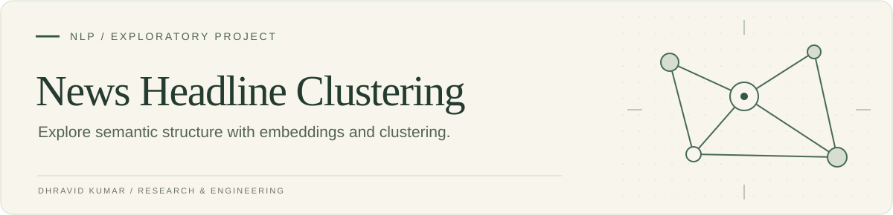

A compact exploration of whether pretrained word embeddings can recover structure in news headlines. The implementation turns headlines into vectors, clusters them, and compares the resulting groups with the dataset's category labels.

[Read the implementation](linear.py) · [Dataset included in this repository](News_Category_Dataset_v3.json)

## Method

1. Load the `glove-wiki-gigaword-200` embedding model through Gensim.
2. Sum the available word vectors for each headline.
3. L2-normalize the headline embeddings and run scikit-learn K-means with 42 clusters.
4. Compare clusters with news-category labels using the Adjusted Rand Index.
5. Print sample headlines from each cluster for qualitative inspection.

## Run the exploration

```bash
git clone https://github.com/Dhravidk/214_final.git
cd 214_final
python -m venv .venv
source .venv/bin/activate
python -m pip install numpy gensim scikit-learn
python linear.py
```

The first execution downloads the pretrained embedding model. Output consists of an Adjusted Rand Index and example headlines from each predicted cluster.

## Interpretation

This repository preserves an early experiment. It uses simple whitespace tokenization and randomized clustering and sampling, so repeated runs can differ. The score compares cluster assignments with the supplied categories; it is not a held-out classifier accuracy. No new performance result is claimed by this documentation update.

<sub>The original repository name and [README](docs/reference/README-before-presentation-refresh.md) are preserved.</sub>
